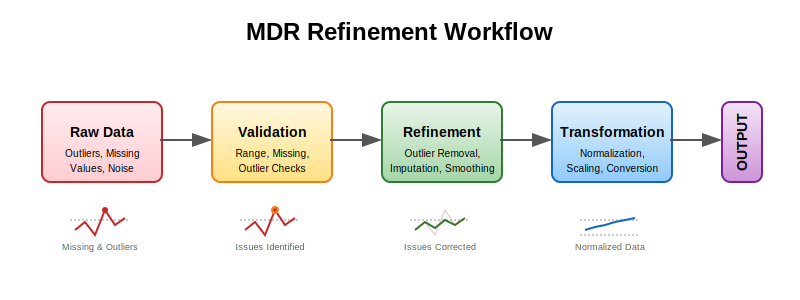

<div align=center>

# Macrodata Refinement (MDR)

[](https://www.python.org/downloads/)
[](https://opensource.org/licenses/MIT)
[](https://github.com/muditbhargava66/macrodata-refinement/actions)
[](https://macrodata-refinement.readthedocs.io/)
[](https://pypi.org/project/macrodata-refinement/)


<p align="center">
  
</p>

**A comprehensive toolkit for refining, validating, and transforming macrodata through various statistical and analytical methods.**
</div>

## Overview

Macrodata Refinement (MDR) is a Python library designed to provide robust tools for working with macrodata - large-scale datasets that often contain outliers, missing values, and other quality issues. MDR offers a systematic approach to data refinement, with a strong emphasis on type safety and data integrity.

### Key Features

- **Data Refinement**: Clean your data by removing outliers, imputing missing values, and smoothing noisy data.
- **Data Validation**: Assess data quality with configurable validation checks.
- **Data Transformation**: Apply various transformations including normalization, scaling, and more.
- **Visualization**: Create insightful visualizations of data and refinement results.
- **I/O Support**: Read and write data in multiple formats (CSV, JSON, Excel, Parquet, HDF5).
- **API Access**: Use the library via REST API or command-line interfaces.
- **Type Safety**: Comprehensive type checking and validation for robust data processing.

## Installation

### From PyPI (Recommended)

```bash
pip install macrodata-refinement
```

For development features:

```bash
pip install "macrodata-refinement[dev]"
```

### From Source

```bash
git clone https://github.com/muditbhargava66/macrodata-refinement.git
cd macrodata-refinement
pip install -e .
```

### Docker

```bash
docker-compose up mdr-api
```

## Quick Start

### Basic Data Refinement

The data refinement process in MDR follows this workflow:

<div align=center>



</div>

```python
import numpy as np
from mdr.core.refinement import refine_data, RefinementConfig

# Create sample data with outliers and missing values
data = np.array([1.0, 2.0, np.nan, 4.0, 100.0])

# Configure refinement
config = RefinementConfig(
    smoothing_factor=0.2,      # Smoothing intensity (0-1)
    outlier_threshold=2.5,     # Z-score threshold for outliers
    imputation_method="linear", # Method for filling missing values
    normalization_type="minmax" # Type of normalization to apply
)

# Refine the data
refined_data = refine_data(data, config)

print("Original data:", data)
print("Refined data:", refined_data)
```

### Data Validation

```python
from mdr.core.validation import validate_data

# Create a dictionary of data variables
data_dict = {
    "temperature": np.array([20.5, 21.3, np.nan, 21.7, 45.0]),
    "pressure": np.array([101.3, 101.4, 80.0, np.nan, np.nan])
}

# Validate the data
validation_results = validate_data(
    data_dict,
    checks=["range", "missing", "outliers"],
    params={
        "range": {
            "min_value": 0.0,
            "max_value": 100.0
        },
        "missing": {
            "threshold": 0.1  # Allow up to 10% missing values
        },
        "outliers": {
            "threshold": 2.5,  # Z-score threshold for outliers
            "method": "zscore"
        }
    }
)

# Print validation results
for var_name, result in validation_results.items():
    print(f"{var_name} validation: {'Passed' if result.is_valid else 'Failed'}")
    if not result.is_valid:
        for msg in result.error_messages:
            print(f"  - {msg}")
```

### Visualization

```python
import matplotlib.pyplot as plt
from mdr.visualization.plots import plot_refinement_comparison

# Create original and refined data
original = np.array([1.0, 2.0, np.nan, 4.0, 100.0])
refined = np.array([1.0, 2.0, 3.0, 4.0, 5.0])

# Create comparison plots
fig, axes = plot_refinement_comparison(original, refined)
plt.tight_layout()
plt.show()
```

### Command-Line Interface

MDR includes a command-line interface for common operations:

```bash
# Refine a CSV file
mdr refine input.csv output.csv --smoothing-factor 0.2 --outlier-threshold 3.0

# Validate a CSV file
mdr validate input.csv --output-file validation_results.json

# Convert between file formats
mdr convert input.csv output.parquet
```

## Documentation

For full documentation, visit [the documentation site](https://macrodata-refinement.readthedocs.io/).

## Examples

For more examples, see the [examples directory](examples/) in the GitHub repository:

- [Basic Usage](examples/basic_usage.py): End-to-end workflow example
- [Jupyter Notebook Tutorial](examples/notebooks/quickstart.ipynb): Interactive tutorial

## Contributing

Contributions are welcome! Please see [CONTRIBUTING.md](CONTRIBUTING.md) for guidelines.

## License

This project is licensed under the MIT License - see the [LICENSE](LICENSE) file for details.

## Project Structure

```
macrodata-refinement/
├── .github/
│   ├── ISSUE_TEMPLATE/
│   │   ├── bug_report.md
│   │   ├── feature_request.md
│   │   └── question.md
│   ├── PULL_REQUEST_TEMPLATE.md
│   └── workflows/
│       ├── ci.yml
│       ├── release.yml
│       └── docs.yml
├── .gitignore
├── LICENSE
├── README.md
├── CONTRIBUTING.md
├── CHANGELOG.md
├── setup.py
├── requirements.txt
├── pyproject.toml
├── Dockerfile
├── docker-compose.yml
├── src/
│   └── mdr/
│       ├── __init__.py
│       ├── core/
│       │   ├── __init__.py
│       │   ├── refinement.py
│       │   ├── validation.py
│       │   └── transformation.py
│       ├── io/
│       │   ├── __init__.py
│       │   ├── readers.py
│       │   ├── writers.py
│       │   └── formats.py
│       ├── utils/
│       │   ├── __init__.py
│       │   ├── logging.py
│       │   └── helpers.py
│       ├── api/
│       │   ├── __init__.py
│       │   ├── rest.py
│       │   └── cli.py
│       └── visualization/
│           ├── __init__.py
│           └── plots.py
├── tests/
│   ├── __init__.py
│   ├── conftest.py
│   ├── unit/
│   │   ├── test_core.py
│   │   ├── test_io.py
│   │   └── test_utils.py
│   ├── integration/
│   │   ├── test_workflows.py
│   │   └── test_api.py
│   └── fixtures/
│       └── sample_data.json
├── docs/
│   ├── conf.py
│   ├── index.rst
│   ├── installation.rst
│   ├── usage.rst
│   └── api/
├── examples/
│   ├── basic_usage.py
│   └── notebooks/
│       └── quickstart.ipynb
└── scripts/
    ├── setup_dev_env.sh
    └── benchmark.py
```

## Development Status

Macrodata Refinement is currently in alpha development status. The API may change before the stable release.

## Citation

If you use Macrodata Refinement in your research, please cite:

```
MDR Team. (2025). Macrodata Refinement: A toolkit for refining and processing macrodata.
https://github.com/muditbhargava66/macrodata-refinement
```

## Acknowledgments

- The MDR team for their contributions.
- The open-source community for the amazing tools that make this project possible.