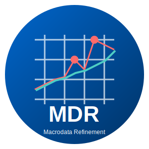
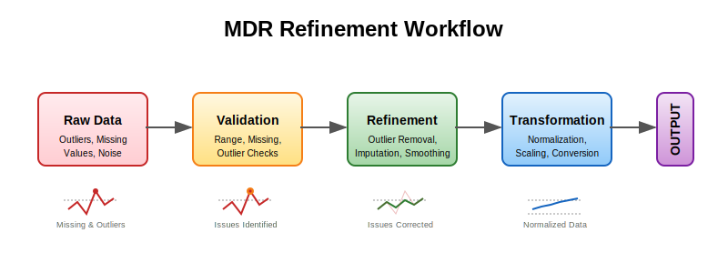

.. Macrodata Refinement documentation master file

Welcome to Macrodata Refinement (MDR)
=====================================

**A comprehensive toolkit for refining, validating, and transforming macrodata through various statistical and analytical methods.**

Overview
--------

Macrodata Refinement (MDR) is a Python library designed to provide robust tools for working with macrodata - large-scale datasets that often contain outliers, missing values, and other quality issues. MDR offers a systematic approach to data refinement, with a strong emphasis on type safety and data integrity.

Key Features
------------

- **Data Refinement**: Clean your data by removing outliers, imputing missing values, and smoothing noisy data.
- **Data Validation**: Assess data quality with configurable validation checks.
- **Data Transformation**: Apply various transformations including normalization, scaling, and more.
- **Visualization**: Create insightful visualizations of data and refinement results.
- **I/O Support**: Read and write data in multiple formats (CSV, JSON, Excel, Parquet, HDF5).
- **API Access**: Use the library via REST API or command-line interfaces.
- **Type Safety**: Comprehensive type checking and validation for robust data processing.

The Refinement Workflow
-----------------------

The data refinement process in MDR follows this workflow:

Contents
--------

.. toctree::
   :maxdepth: 2
   :caption: Contents:

   installation
   usage
   api/index
   examples
   contributing
   changelog

Indices and tables
==================

* :ref:`genindex`
* :ref:`modindex`
* :ref:`search`
